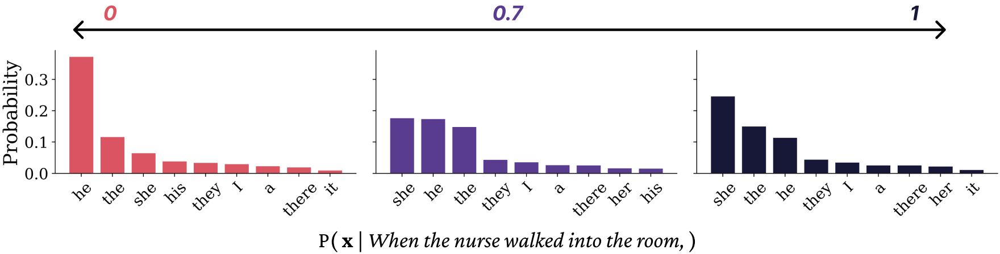

A **[Backpack](https://arxiv.org/abs/2305.16765)** is a drop-in replacement for a Transformer that provides new tools for **interpretability-through-control** while still enabling strong language models.
Backpacks decompose the predictive meaning of words into components non-contextually, and aggregate them by a weighted sum, allowing for precise, predictable interventions.


A Backpack model is a neural network that operates on sequences of symbols. It (1) learns a set of _sense vectors_ of meaning for each symbol, and (2) in context, weights and sums each sense vector of that context to represent each word of the sequence.


When training Backpack Language Models, we find that sense vectors specialize to represent fine-grained aspects of predictive utility for each word.
Intuitively, sense vectors **non-contextually specify the span of ways in which the word might be useful in context,** and the context decides what member of that span to take.

The direct connection between symbol meaning and model prediction enables new directions in interpretability and control.
This simplicity is enabled by the use of existing, opaque neural architectures (like the Transformer) _only in the role of generating weights for the sum_.
For one example of control in our ACL paper, we identify a source of gender bias in stereotypically gendered career nouns as being partially derived from a single sense vector, and "turn down" the weights on that sense to reduce bias:



The name "Backpack" is inspired by the fact that a backpack is like a bag---but more orderly. Like a bag-of-words, a Backpack representation is a sum of non-contextual senses, but a Backpack is more orderly, because the weights in this sum depend on the ordered sequence.

<!--     -->

#### Limitations
We do not believe the Backpack is an "inherently interpretable" architecture, or that sense vectors make interpretability easy.
We do believe that the decomposition implemented in Backpacks does allow for new tools, the utility of which we're exploring.
We discuss limitations in our paper, but to name a few, many sense vectors have no obvious interpretation, and _many_ are combined together to form the final prediction; furthermore, sense vectors assign scores over the whole vocabulary, which our visualizations do not show most of.


#### Demo a Backpack language model

- Visualize sense vectors [here](https://huggingface.co/spaces/stanfordnlp/Backpack-Demo) (Individual Word Sense Look Up tab).
- Generate from and control a Backpack language model [here](https://huggingface.co/spaces/stanfordnlp/Backpack-Demo) (Language Modeling tab).

#### Train or finetune your own Backpacks
- Download and use our up-to-170M parameter models on [HuggingFace](https://huggingface.co/stanfordnlp/backpack-gpt2).
- To get the gist, use our simple implementation on Andrej Karpathy's nanoGPT; [nanoBackpackGPT (out soon)](#).
- Like JAX and TPUs? We have an implementation in JAX via Stanford's [Levanter library (out soon)](#).
- Want to reproduce our ACL paper? Our original implementation is in FlashAttention, [here](https://github.com/john-hewitt/backpacks-flash-attn).

#### Citation

In our ACL paper, _[Backpack Language Models](https://arxiv.org/abs/2305.16765)_, we introduced and evaluated Backpacks.
If you find the ideas or models here useful, please cite:

```
@InProceedings{hewitt2023backpack,
  author =      "Hewitt, John and Thickstun, John and Manning, Christopher D. and Liang, Percy",
  title =       "Backpack Language Models",
  booktitle =   "Proceedings of the Association for Computational Linguistics",
  year =        "2023",
  publisher =   "Association for Computational Linguistics",
  location =    "Toronto, Canada",
}
```

#### Acknowledgements

This work was supported by the Stanford Natural Language Processing Group, Stanford Center for Research on Foundation Models, and the Stanford Artificial Intelligence Laboratory.
All errors are our own, and all opinions do not necessarily reflect the organizations.


Demos were developed by [Lora Xie](https://www.linkedin.com/in/loraxie/). Considerable feedback and advice on paper drafts given by Steven Cao, Xiang Lisa Li, and the rest of the Stanford NLP Group community. The work wouldn't have been possible without [FlashAttention](https://github.com/HazyResearch/flash-attention/); thanks Tri Dao and Hazy Research!
John Hewitt was supported by the National Science Foundation Graduate Research Fellowship under grand number DGE-1656518.
